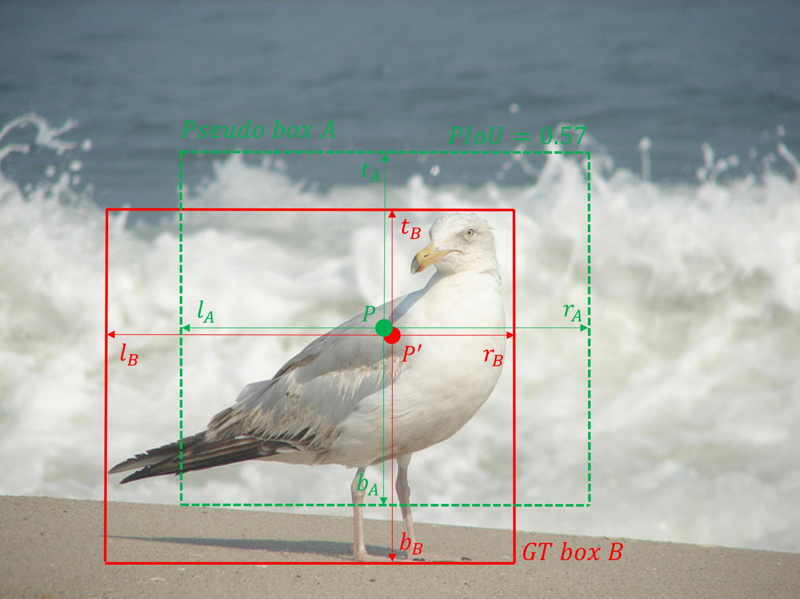

# Pseudo-IoU-for-Anchor-Free-Object-Detection

This is the repo to host the code for **Pseudo-IoU** in the following paper: [Arxiv link](https://arxiv.org/abs/2104.14082)

By [Jiachen Li](https://chrisjuniorli.github.io/), [Bowen Cheng](https://bowenc0221.github.io/), [Rogerio Feris](https://mitibmwatsonailab.mit.edu/people/rogerio-feris/), [Jinjun Xiong](https://researcher.watson.ibm.com/researcher/view.php?person=us-jinjun), [Thomas S.Huang](http://ifp-uiuc.github.io/), [Wen-Mei Hwu](http://impact.crhc.illinois.edu/People/Hwu/hwu.aspx) and [Humphrey Shi](https://www.humphreyshi.com).


## Introduction

<p align="center">
  
</p>

Current anchor-free object detectors are quite simple and effective yet lack accurate label assignment methods, which limits their potential in competing with classic anchor-based models that are supported by welldesigned assignment methods based on the Intersectionover-Union (IoU) metric. In this paper, we present Pseudo Intersection-over-Union (Pseudo-IoU): a simple metric that brings more standardized and accurate assignment rule into anchor-free object detection frameworks without any additional computational cost or extra parameters for training and testing, making it possible to further improve anchor-free object detection by utilizing training samples of good quality under effective assignment rules that have been previously applied in anchor-based methods. By incorporating Pseudo-IoU metric into an end-toend single-stage anchor-free object detection framework, we observe consistent improvements in their performanceon general object detection benchmarks such as PASCAL VOC and MSCOCO. Our method (single-model and singlescale) also achieves comparable performance to other recent state-of-the-art anchor-free methods without bells and whistles.

## Prerequisites

- Python 3.7
- PyTorch 1.7.0
- CUDA 11.0
- MMdetection v2.11.0

Please following the installation of mmdetection and merges Pseudo-IoU configs and models into mmdetection folder.

## Results

More models will be released soon

| Backbone  | Lr schd | box_mAP | box_mAP_50| box_mAP_75 | box_mAP_s | box_mAP_m | box_mAP_l | Config | Download |
|:---------:|:-------:|:-------:|:---------:|:----------:|:---------:|:---------:|:---------:|:------:|:--------:|
| R-50      | 1x      | 38.4    | 57.4      |       40.9 |23.8       |42.5       |48.8       | [config](https://github.com/SHI-Labs/Pseudo-IoU-for-Anchor-Free-Object-Detection/blob/main/configs/pseudo-iou/piou_r50_caffe_fpn_gn-head_1x_coco.py) | [model](https://drive.google.com/file/d/1xO1oeF1qqsZzsvJzH-MtcKyBOsOzZbrx/view?usp=sharing) |


## Citation

```bibtex
@article{li2021pseudoiou,
  title={Pseudo-IoU: Improving Label Assignment in Anchor-Free Object Detection},
  author={Jiachen Li, Bowen Cheng, Rogerio Feris, Jinjun Xiong, Thomas S.Huang, Wen-Mei Hwu and Humphrey Shi},
  journal={arXiv preprint arXiv:2104.14082},
  year={2021}
}
```

